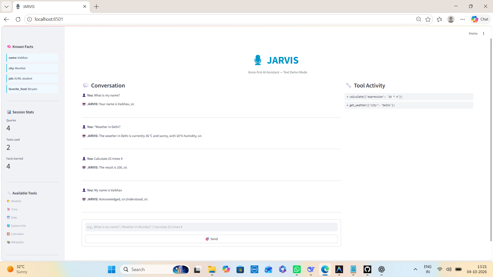

<div align="center">

# 🎙️ JARVIS

### Voice-First AI Assistant with Memory, Tool Calling & Local Speech Processing

**An Iron Man inspired AI assistant that listens, understands, reasons, remembers, uses tools, and responds naturally through voice — with the core voice pipeline running locally on CPU.**

<br>

[](https://www.python.org/)
[](https://groq.com/)
[](https://github.com/SYSTRAN/faster-whisper)
[](https://github.com/dscripka/openWakeWord)
[](https://www.trychroma.com/)
[](https://streamlit.io/)
[](LICENSE)

<br>

**Wake Word → Speech-to-Text → Memory Retrieval → LLM Reasoning → Tool Calling → Text-to-Speech**

<br>

[🚀 Quick Start](#-quick-start) •
[🏗️ Architecture](#️-architecture) •
[🧠 Memory](#-memory-system) •
[🔧 Tools](#-tool-calling-system) •
[📊 Performance](#-performance) •
[🎓 Interview](#-interview-ready-talking-points)

</div>

---

# 📸 Demo

<p align="center">
  
</p>

> Streamlit dashboard showing conversation history, memory recall, tool activity and session statistics.

---

# 🤖 What is JARVIS?

**JARVIS** is a voice-first AI assistant designed to demonstrate how modern AI engineering components can be combined into a single intelligent system.

Instead of building a simple chatbot, JARVIS combines:

* 🎙️ Wake-word detection
* 🎤 Local speech recognition
* 🧠 LLM-based reasoning
* 🔧 Dynamic tool/function calling
* 💾 Persistent semantic memory
* 💬 Multi-turn conversation
* 🔊 Neural text-to-speech
* 🖥️ Interactive Streamlit dashboard

The assistant can listen for **"Hey Jarvis"**, convert speech into text, retrieve relevant memory, allow the LLM to decide whether a tool is required, execute that tool, generate a response and finally speak the answer.

### Example

```text
User:
"Hey Jarvis, what's the weather in Delhi?"

        ↓

Wake Word Detection
        ↓
Speech-to-Text
        ↓
Memory Retrieval
        ↓
LLM Reasoning
        ↓
Tool Call → get_weather("Delhi")
        ↓
Tool Result
        ↓
LLM Response
        ↓
Text-to-Speech
        ↓
🔊 "The weather in Delhi is currently 36°C and sunny."
```

---

# ✨ Key Features

| Feature               | Description                                         |
| --------------------- | --------------------------------------------------- |
| 🎙️ Wake Word         | Detects "Hey Jarvis" using openWakeWord             |
| 🎤 Local STT          | Speech recognition using faster-whisper             |
| 🧠 LLM Reasoning      | Groq GPT-OSS-120B for intelligent responses         |
| 🔧 Function Calling   | LLM dynamically decides when tools are required     |
| 💾 Long-Term Memory   | Persistent memory using ChromaDB                    |
| 🧩 Semantic Retrieval | Retrieves relevant facts and previous conversations |
| 💬 Multi-Turn Context | Maintains conversation context                      |
| 🔊 Text-to-Speech     | Natural voice using edge-tts                        |
| 🖥️ Dashboard         | Streamlit interface for monitoring JARVIS           |
| 💻 System Tools       | CPU, RAM and battery information                    |
| 🌤️ Weather           | Real-time weather lookup                            |
| 🧮 Calculator         | Safe mathematical evaluation                        |
| 📚 Wikipedia          | Knowledge lookup through Wikipedia                  |
| 📅 Date & Time        | Current date and time tools                         |
| ⚡ CPU Friendly        | Core voice pipeline works without a GPU             |

---

# 🏗️ Architecture

```text
                         ┌──────────────────────┐
                         │      🎙️ MICROPHONE    │
                         └──────────┬───────────┘
                                    │
                                    ▼
                         ┌──────────────────────┐
                         │   👂 WAKE WORD       │
                         │    openWakeWord      │
                         │    "Hey Jarvis"      │
                         └──────────┬───────────┘
                                    │
                              Wake Trigger
                                    │
                                    ▼
                         ┌──────────────────────┐
                         │   🎤 SPEECH-TO-TEXT  │
                         │    faster-whisper    │
                         │       CPU            │
                         └──────────┬───────────┘
                                    │
                                    ▼
                         ┌──────────────────────┐
                         │   💾 MEMORY RETRIEVAL │
                         │      ChromaDB        │
                         │ Facts + Conversations│
                         └──────────┬───────────┘
                                    │
                                    ▼
                    ┌───────────────────────────────┐
                    │        🧠 LLM REASONING       │
                    │       Groq GPT-OSS-120B       │
                    │                               │
                    │  • Understands user intent    │
                    │  • Maintains context          │
                    │  • Decides required tools     │
                    └──────────────┬────────────────┘
                                   │
                         ┌─────────┴─────────┐
                         │                   │
                         ▼                   ▼
                ┌────────────────┐   ┌────────────────┐
                │ 🔧 TOOL CALL   │   │ 💬 DIRECT      │
                │                │   │    RESPONSE    │
                │ Weather        │   └───────┬────────┘
                │ Time / Date    │           │
                │ Calculator     │           │
                │ Wikipedia      │           │
                │ System Info    │           │
                └───────┬────────┘           │
                        │                    │
                        └─────────┬──────────┘
                                  ▼
                         ┌──────────────────────┐
                         │   🔊 TEXT-TO-SPEECH  │
                         │       edge-tts       │
                         └──────────┬───────────┘
                                    │
                                    ▼
                         ┌──────────────────────┐
                         │      🎧 AUDIO OUT    │
                         └──────────────────────┘
```

---

# 🔄 End-to-End AI Pipeline

JARVIS follows a complete agent-like interaction loop:

```text
1. Listen
   ↓
2. Detect "Hey Jarvis"
   ↓
3. Record user speech
   ↓
4. Convert speech → text
   ↓
5. Retrieve relevant memory
   ↓
6. Send context + query to LLM
   ↓
7. LLM decides:
      ├── Answer directly
      └── Call one or more tools
   ↓
8. Execute selected tools
   ↓
9. Return tool results to LLM
   ↓
10. Generate final response
   ↓
11. Convert text → speech
   ↓
12. Play response
   ↓
13. Store conversation + important facts
```

This makes the project more than a basic chatbot — it demonstrates an **LLM-powered tool-using assistant with persistent memory**.

---

# 🎬 Demo Flow

### Basic Voice Interaction

```text
👂 Listening for "Hey Jarvis"...

✨ Wake word detected!

🎤 Recording...

🔍 Transcribing...

👤 You:
"What time is it?"

🧠 Thinking...

🔧 Using tool:
get_time({})

← Tool Result:
12:45 PM

🤖 Jarvis:
"It's 12:45 PM, sir."

🔊 Speaking...
```

---

# 🧠 Memory System

One of the main features of JARVIS is **persistent semantic memory**.

JARVIS uses:

```text
ChromaDB
   +
Sentence Transformers
   +
Fact Extraction
   +
Conversation Embeddings
```

### 1. Long-Term Facts

Important information can be extracted and stored as persistent facts.

Examples:

```text
User:
"My name is Vaibhav."

        ↓

Fact Extraction

name = Vaibhav

        ↓

facts.json
        +
ChromaDB
```

### 2. Conversation Memory

Conversation turns are embedded and stored.

When a new query arrives:

```text
New Query
    ↓
Embedding
    ↓
Semantic Search
    ↓
Relevant Memories
    ↓
LLM Context
```

This allows JARVIS to retrieve relevant information even when the exact words are different.

---

# 🔁 Memory Example

```text
SESSION 1

👤 User:
"My name is Vaibhav."

🤖 JARVIS:
"Acknowledged, sir."

        ↓

Memory:
name = Vaibhav

        ↓

Application Restart
```

Later:

```text
SESSION 2

👤 User:
"What is my name?"

        ↓

ChromaDB Retrieval

Known fact:
name = Vaibhav

        ↓

🤖 JARVIS:
"Your name is Vaibhav, sir."
```

### Why this matters

A normal chatbot may lose state after the conversation ends.

JARVIS maintains persistent memory across restarts, making the assistant **stateful rather than purely stateless**.

---

# 🔧 Tool Calling System

JARVIS uses **LLM-driven function calling** rather than hardcoded `if/else` rules.

The LLM receives tool schemas and determines whether a tool is required.

### Available Tools

| Tool                  | Purpose                   | Example                        |
| --------------------- | ------------------------- | ------------------------------ |
| 🌤️ `get_weather`     | Weather information       | "What's the weather in Delhi?" |
| ⏰ `get_time`          | Current time              | "What time is it?"             |
| 📅 `get_date`         | Current date              | "What's today's date?"         |
| 💻 `get_system_info`  | CPU/RAM/battery           | "How is my system doing?"      |
| 🧮 `calculate`        | Mathematical calculations | "Calculate 25 × 4"             |
| 📚 `search_wikipedia` | Wikipedia lookup          | "Who is Elon Musk?"            |

### Tool Calling Flow

```text
User Query
    ↓
LLM
    ↓
Does this require a tool?
    │
    ├── No
    │     ↓
    │   Direct Answer
    │
    └── Yes
          ↓
       Tool Call
          ↓
       Execute Tool
          ↓
       Tool Result
          ↓
       LLM
          ↓
       Final Answer
```

The system can therefore support queries that require external information without hardcoding every possible user request.

---

# 🖥️ Streamlit Dashboard

The Streamlit dashboard provides a visual interface for interacting with and monitoring JARVIS.

### Dashboard capabilities

* 💬 Live conversation history
* 🧠 Known facts panel
* 🔧 Tool activity log
* 📊 Session statistics
* 🎯 Text input mode
* 📈 Memory visibility

### Run Dashboard

```bash
streamlit run src/ui/app.py
```

Text mode is especially useful for:

* Debugging
* Development
* Demonstrations
* Interviews
* Testing without a microphone

---

# 🛠️ Tech Stack

| Layer          | Technology                     | Role                         |
| -------------- | ------------------------------ | ---------------------------- |
| Language       | Python 3.11                    | Application development      |
| Wake Word      | openWakeWord                   | "Hey Jarvis" detection       |
| Speech-to-Text | faster-whisper                 | Local speech recognition     |
| LLM            | Groq GPT-OSS-120B              | Reasoning + function calling |
| Embeddings     | Sentence Transformers / MiniLM | Semantic memory              |
| Vector Store   | ChromaDB                       | Persistent memory            |
| Text-to-Speech | edge-tts                       | Neural voice generation      |
| Audio          | sounddevice                    | Microphone/audio I/O         |
| UI             | Streamlit                      | Dashboard                    |
| HTTP           | requests                       | API requests                 |
| System         | psutil                         | CPU/RAM/battery monitoring   |

---

# 🚀 Quick Start

## Prerequisites

Before running JARVIS, make sure you have:

* Python **3.11**
* Working microphone
* Internet connection
* Groq API key
* Windows/Linux/macOS environment capable of running the required Python audio packages

---

## 1️⃣ Clone Repository

```bash
git clone https://github.com/vaibhav07772/jarvis.git
cd jarvis
```

---

## 2️⃣ Create Environment

### Conda

```bash
conda create -n jarvis python=3.11 -y
conda activate jarvis
```

### Or Python venv

```bash
python -m venv .venv
```

Activate it:

### Windows

```bash
.venv\Scripts\activate
```

### Linux/macOS

```bash
source .venv/bin/activate
```

---

## 3️⃣ Install Dependencies

```bash
pip install -r requirements.txt
```

---

## 4️⃣ Configure API Key

Create a `.env` file in the project root:

```env
GROQ_API_KEY=gsk_your_key_here
```

Never commit your real API key to GitHub.

---

## 5️⃣ Download Wake Word Models

Run once:

```bash
python -c "import openwakeword; openwakeword.utils.download_models()"
```

---

# ▶️ Run JARVIS

## Voice Mode

```bash
python -m src.jarvis_core
```

Then say:

```text
Hey Jarvis
```

---

## Streamlit Dashboard

```bash
streamlit run src/ui/app.py
```

---

# 🧪 Component Testing

Each major component can be tested independently.

### Microphone

```bash
python test_audio.py
```

### Wake Word

```bash
python src/voice/test_wake_word.py
```

### Speech-to-Text

```bash
python src/voice/test_stt.py
```

### Text-to-Speech

```bash
python src/voice/test_tts.py
```

### LLM

```bash
python src/llm/test_llm.py
```

### Tools

```bash
python -m src.tools.jarvis_tools
```

### Memory

```bash
python -m src.memory.jarvis_memory
```

---

# 📁 Project Structure

```text
jarvis/
│
├── src/
│   ├── jarvis_core.py
│   │
│   ├── voice/
│   │   ├── test_wake_word.py
│   │   ├── test_stt.py
│   │   └── test_tts.py
│   │
│   ├── llm/
│   │   └── test_llm.py
│   │
│   ├── tools/
│   │   └── jarvis_tools.py
│   │
│   ├── memory/
│   │   └── jarvis_memory.py
│   │
│   └── ui/
│       └── app.py
│
├── data/
│   ├── audio/
│   └── memory/
│
├── docs/
│   └── screenshot.png
│
├── test_audio.py
├── requirements.txt
├── .env
└── README.md
```

---

# ⚡ Performance

Approximate observed performance:

| Metric              | Approximate Value |
| ------------------- | ----------------: |
| Wake Word Accuracy  |              ~99% |
| Wake Word Latency   |           ~200 ms |
| STT Latency         |          ~1–2 sec |
| LLM Latency         |       ~500–800 ms |
| TTS Latency         |       ~300–500 ms |
| End-to-End Response |          ~2–3 sec |

> Performance depends on hardware, microphone, network conditions and model configuration.

---

# 💰 Cost

The project is designed around **free/local components**.

```text
Wake Word       → Local
STT             → Local
Memory          → Local
Vector Store    → Local
LLM             → Groq free tier / API usage
TTS             → edge-tts
UI              → Streamlit
```

### Approximate development cost

**$0 using available free/local tiers.**

API provider limits and policies may change over time.

---

# 🔐 Privacy

JARVIS is designed with a privacy-first architecture for the local components.

| Component      | Processing                         |
| -------------- | ---------------------------------- |
| Wake Word      | 🟢 Local                           |
| Speech-to-Text | 🟢 Local                           |
| Memory         | 🟢 Local                           |
| LLM            | 🟡 Text sent to Groq               |
| TTS            | 🟡 Text sent to Microsoft edge-tts |
| Raw Audio      | 🟢 Processed in memory             |

### Important

Although wake-word detection, STT and memory run locally, **LLM prompts and TTS text are sent to their respective external services**.

Do not send sensitive information through the external APIs.

---

# ⚠️ Current Limitations

JARVIS is a portfolio/research project and has several known limitations:

### 1. Fixed Recording Window

The current voice pipeline records for a fixed duration.

```text
Current:
Record → 5 seconds → Transcribe
```

A future version can use Voice Activity Detection:

```text
Start Speaking
      ↓
Voice Activity Detection
      ↓
Stop after Silence
      ↓
Transcribe
```

### 2. Whisper Tiny Model

The tiny model provides low resource usage but may occasionally confuse words.

A larger Whisper model can improve recognition quality at the cost of additional compute.

### 3. CPU Inference

The project prioritizes CPU compatibility, which increases inference latency compared with GPU execution.

### 4. English-Focused Interaction

The current prompting and interaction flow are primarily designed around English.

### 5. Local-Only Authentication

The application currently assumes a trusted local environment and does not implement user authentication.

---

# 🧩 Engineering Challenges Solved

Building a voice agent involves more than simply connecting an LLM to a microphone.

### 🎧 1. Audio Sample Rate Mismatch

Some microphones/headsets operate at different sample rates.

The wake-word pipeline expects:

```text
16 kHz
```

while certain devices may provide:

```text
44.1 kHz
```

Runtime resampling was therefore required.

---

### 🤖 2. LLM Model Migration

The project experienced an LLM model transition when an earlier model was deprecated.

The architecture was adapted to use:

```text
Groq
   ↓
GPT-OSS-120B
```

This demonstrates why production AI systems should avoid tightly coupling business logic to a single model.

---

### 🔊 3. TTS Compatibility

The project encountered compatibility/authentication issues with `edge-tts`.

The solution involved upgrading the package to a compatible 7.x version.

---

### 💾 4. Vector Database Telemetry

ChromaDB telemetry output was noisy during development.

Telemetry configuration was adjusted so development logs remained clean.

---

# 🎓 Interview-Ready Talking Points

This project is especially useful for an **AI Engineer / GenAI Engineer** interview because it demonstrates several production-relevant concepts.

---

## Q1. Why did you use local speech-to-text?

### Interview Answer

> "I used faster-whisper with the tiny model for local speech recognition because it provides a good balance between resource usage, latency and privacy. The audio processing happens locally, so raw audio does not need to be sent to a cloud speech API. For a production system, I would evaluate larger Whisper variants or GPU inference when higher accuracy is required."

---

## Q2. How does tool calling work?

### Interview Answer

> "The LLM receives structured tool schemas describing the available functions. When the user asks something that requires external information, the model generates a tool call containing the tool name and arguments. JARVIS executes that function, returns the result to the LLM, and the LLM then generates the final natural-language response."

---

## Q3. How did you implement memory?

### Interview Answer

> "I use ChromaDB with sentence-transformer embeddings for semantic memory. Important facts and conversation turns are stored and embedded. Before generating a response, JARVIS retrieves semantically relevant memories and injects them into the LLM context. This allows the assistant to maintain useful state across conversations and application restarts."

---

## Q4. Why use a vector database?

### Interview Answer

> "A vector database allows semantic retrieval rather than exact keyword matching. For example, if the stored memory says 'I live in Mumbai' and the user later asks 'Which city do I live in?', semantic similarity can retrieve the relevant memory even though the wording is different."

---

## Q5. Why openWakeWord?

### Interview Answer

> "I chose openWakeWord because it is open source, can run locally on CPU and provides a practical way to implement wake-word detection without depending on a proprietary cloud service. The trade-off is that wake-word sensitivity needs to be tuned to balance false positives and false negatives."

---

## Q6. How would you improve JARVIS for production?

### Interview Answer

> "I would introduce Voice Activity Detection instead of a fixed recording window, use a stronger speech-recognition model where latency permits, add authentication and authorization, introduce structured observability and tracing, containerize the services, add more tools such as email and calendar, implement better memory lifecycle management, and add evaluation pipelines for tool-calling accuracy and response quality."

---

# 🧠 AI Engineering Concepts Demonstrated

This project covers several concepts that are directly relevant to modern AI Engineering:

```text
                JARVIS
                  │
       ┌──────────┼──────────┐
       │          │          │
       ▼          ▼          ▼
     GenAI      Agents     RAG/Memory
       │          │          │
       ▼          ▼          ▼
      LLM     Tool Calling  Embeddings
       │          │          │
       └──────────┼──────────┘
                  │
                  ▼
             AI Application
                  │
        ┌─────────┼─────────┐
        ▼         ▼         ▼
      Voice     Tools      UI
```

### Skills demonstrated

* LLM application development
* Function/tool calling
* Prompt/context management
* Semantic search
* Embeddings
* Vector databases
* Persistent memory
* Speech-to-text
* Text-to-speech
* Agent-style workflows
* API integration
* Python application architecture
* Streamlit
* CPU inference
* AI system debugging

---

# 🗺️ Roadmap

## ✅ Completed

* [x] Wake-word detection
* [x] Local speech-to-text
* [x] LLM reasoning
* [x] Function/tool calling
* [x] Weather tool
* [x] Time tool
* [x] Date tool
* [x] Calculator
* [x] Wikipedia search
* [x] System information
* [x] Persistent ChromaDB memory
* [x] Conversation history
* [x] Text-to-speech
* [x] Streamlit dashboard
* [x] CPU-compatible voice pipeline

## 🔮 Planned

* [ ] Voice Activity Detection
* [ ] Improved Whisper model
* [ ] Hindi / multilingual support
* [ ] Email integration
* [ ] Calendar integration
* [ ] File-system tools
* [ ] Better memory management
* [ ] Authentication
* [ ] Docker deployment
* [ ] Production observability
* [ ] Automated evaluation
* [ ] Custom wake-word training

---

# 🚀 Future Production Architecture

A production-ready version could evolve toward:

```text
                   Client
                     │
                     ▼
              API / Gateway
                     │
          ┌──────────┴──────────┐
          ▼                     ▼
     Voice Service          Text Service
          │                     │
          └──────────┬──────────┘
                     ▼
              Agent Orchestrator
                     │
          ┌──────────┼──────────┐
          ▼          ▼          ▼
        LLM       Memory      Tools
          │          │          │
          ▼          ▼          ▼
       Model      Vector DB   APIs
       Gateway
          │
          ▼
      Observability
          │
    ┌─────┼─────┐
    ▼     ▼     ▼
  Logs  Metrics Traces
```

Potential production technologies could include:

```text
FastAPI
Docker
Kubernetes
Redis
PostgreSQL
Vector Database
LLM Gateway
OpenTelemetry
Prometheus
Grafana
CI/CD
```

---

# 📊 Why This Project Matters

JARVIS is not simply a voice chatbot.

It demonstrates the integration of multiple AI engineering components into one end-to-end application:

```text
Speech
  +
LLM
  +
Tool Calling
  +
Memory
  +
Semantic Retrieval
  +
APIs
  +
Text-to-Speech
  +
User Interface
```

This makes it a strong portfolio project for roles such as:

* **AI Engineer**
* **AI/ML Engineer**
* **Generative AI Engineer**
* **LLM Engineer**
* **AI Application Engineer**
* **GenAI Intern**
* **Machine Learning Engineer**

---

# 🔒 Environment Variables

Create a `.env` file:

```env
GROQ_API_KEY=your_groq_api_key
```

### Never commit secrets

Make sure `.env` is included in `.gitignore`:

```gitignore
.env
__pycache__/
*.pyc
.venv/
data/audio/
data/memory/
```

---

# 📜 License

MIT License

Copyright © **Vaibhav Singh**

---

# 🙏 Acknowledgements

This project uses and is inspired by:

* [openWakeWord](https://github.com/dscripka/openWakeWord)
* [faster-whisper](https://github.com/SYSTRAN/faster-whisper)
* [Groq](https://groq.com/)
* [edge-tts](https://github.com/rany2/edge-tts)
* [ChromaDB](https://www.trychroma.com/)
* [Streamlit](https://streamlit.io/)

Inspired by **Iron Man's JARVIS**.

---

<div align="center">

# ⭐ If you found this project interesting, consider starring the repository!

### Built with ❤️ and Python

**Vaibhav Singh**

</div>
